# Cloud-Native Job Tracker

A production-style full-stack job application tracker built with React, Node.js, PostgreSQL, Docker Compose, and GitHub Actions.

## Why this project exists

Most portfolio apps only show UI. This project shows that I can build a useful app and package it like a real engineering project: frontend, backend, database, containerization, environment variables, API health checks, and CI.

## Features

- Add job applications with company, role, location, status, priority, and notes.
- Track statuses: Saved, Applied, Interview, Offer, Rejected.
- Dashboard statistics.
- Search/filter by status.
- REST API with validation.
- PostgreSQL persistence.
- Docker Compose local development.
- GitHub Actions CI pipeline.
- Health check endpoint.

## Tech stack

- Frontend: React, Vite, CSS
- Backend: Node.js, Express
- Database: PostgreSQL
- DevOps: Docker, Docker Compose, GitHub Actions

## Architecture

```mermaid
flowchart LR
  User[User Browser] --> Frontend[React Frontend]
  Frontend --> API[Node.js Express API]
  API --> DB[(PostgreSQL)]
  GitHub[GitHub Push] --> Actions[GitHub Actions CI]
  Actions --> Tests[Install + Lint + Build Check]
```



## Local setup

```bash
cp .env.example .env
docker compose up --build
```

Open:

- Frontend: `http://localhost:5173`
- Backend health: `http://localhost:8080/health`

## Run without Docker

Terminal 1:

```bash
cd backend
npm install
npm run dev
```

Terminal 2:

```bash
cd frontend
npm install
npm run dev
```

## API endpoints

| Method | Endpoint | Purpose |
|---|---|---|
| GET | `/health` | API health check |
| GET | `/api/applications` | List applications |
| POST | `/api/applications` | Create application |
| PATCH | `/api/applications/:id` | Update application |
| DELETE | `/api/applications/:id` | Delete application |

## Environment variables

See `.env.example`.

## Screenshots

Add screenshots inside `docs/screenshots/` after running the project.

## What this demonstrates

- Full-stack architecture
- API design
- SQL database integration
- Docker Compose development environment
- Environment-based configuration
- CI workflow discipline
- Documentation quality
