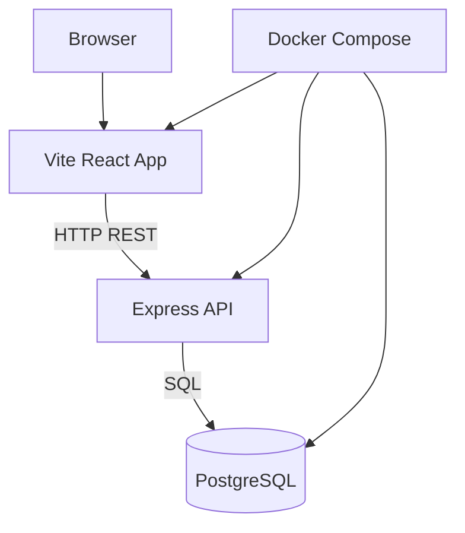

# Architecture Notes

## Local development

## Production improvement ideas

- Deploy frontend to Vercel/Netlify/Cloudflare Pages.
- Deploy backend to Render/Fly.io/AWS ECS.
- Use managed PostgreSQL.
- Add JWT authentication.
- Add OpenTelemetry traces.
- Add Prometheus metrics endpoint.
